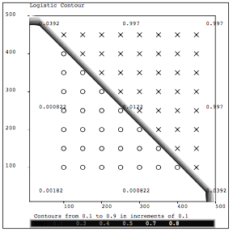
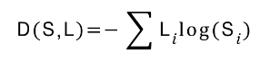
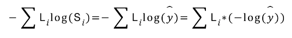
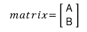
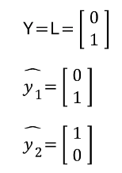
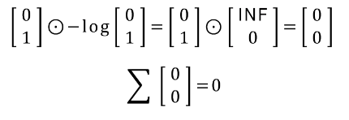
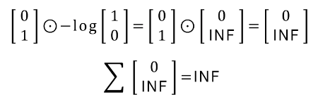
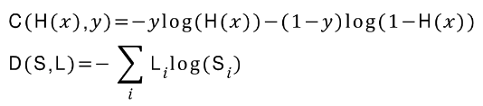
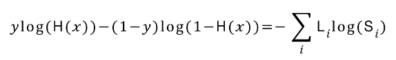
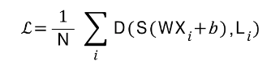

## [Day 6 : Softmax Classification - Multinomial Classification]

```Multinomial Classification``` : 여러개의 class가 있을 때 그것을 예측하는 것. 가장 많이 사용하는 것이 ```Softmax Classification```.

### <Logistic Classification>

W를 학습한다. or Logistific classification을 학습시킨다 => 0 or 1의 경계(```hyperplain```)를 찾아내는 것.



### <Multinomial Classification>

똑같은 개념으로, 예를 들어 Blue Group, Red Group, Green Group이 있을 때,\
\
- Blue or not
- Red or not
- Green or not\
이렇게 경계를 구분한다면, ```Binary classification```으로도 구현이 가능하다.

**그렇다면, 3가지의 x가 주어졌을 때, Blue, Red, Green의 classifier가 존재하여, Binary classification을 3번 거치게 되면 ŷ(예측값)이 나올 것이다.**

**이때, classification알고리즘을 구현해도 되지만, vector로 처리하여, matrix mul하면, 한번에 계산이 가능하다. 또한 독립된 Classification처럼 구현이 가능하다.\
=>이것이 ```Softmax Classification```**

### <Softmax Classification>

Logistic Classsifier을 거치고 나온 ŷ은 3가지 입력값에 따른 [2.0  1.0  0.1]이 나왔다고 하자.\
이 결과값은 H(x)값이다. ```Softmax```를 하면, [0.7  0.2  0.1]이 나오게 된다.\
이때, ```One-Hot Encoding```을 하면, [1.0   0.0   0.0]이 된다.\
```=> Blue is correct.```

***이때, Softmax를 거친 값들의 합은 1이 되는 특징.**

### <Cross Entropy>

Y(실제 값)와 ŷ(예측값)의 차이가 얼마인지 알아내는 함수.\
즉, 두 확률 분포 p와 q 사이에 존재하는 정보량을 계산하는 방법.



식에선, L=Y, S=ŷ 으로 표현하였다.
- D(S,L) : S와 L의 cross entropy.
- L : 실제 값의 확률 분포.  0 or 1
- S : softmax를 통한, 예측 값의 확률 분포.  0.7 or 0.2 or 0.1

위 식을 조금 변형시켜서, sigma외부에 있는 minus(-) 부호를 내부로 가져와 log함수 앞에 놓자.\
그러면 logistic classification에서 본, -log 함수가 된다.\
\
**=>즉, log값은 0~1 사이의 값이다.**

**(참고. 위 함수에서 p(x)와 log(q(x))는 시그마 하위에 있는 함수이다.)**

예를 들어보자.\
\
\
따라서,
- L = B
- ŷ1 = B
- ŷ2 = A
즉, ŷ1은 옳고 ŷ2는 틀렸다는 것을 알 수 있다.

이를 위 식처럼 계산 해보자.\
**(Cost Function처럼 0이 되야 좋은 것.)**

#### <ŷ1의 경우>
\
- Cost = 0
- ŷ1은 맞는 예측.

#### <ŷ2의 경우>
\
- Cost = INF
- ŷ2는 틀린 예측.

**지금까지 배운것으로 예측해보면, 이전에 다루었던 Logistic Cost와 Cross Entropy는 유사함을 알 수 있다.**\
\
에서, 
- H(x) = S
- y = L
이렇게 대응된다. 따라서 아래와 같은 식을 도출할 수 있다.\
\
****
### Cost Function & gradient decent

Cost(Loss) Function은 다음과 같다.\
\
=>여러개의 training set이 있을 때, 그것들의 distance를 구해서 평균을 내준 것.

Cost를 최소화하는 Gradient descent Algorithm는 미분하면 되겠다.\
=>log의 미분은 생략하겠다.